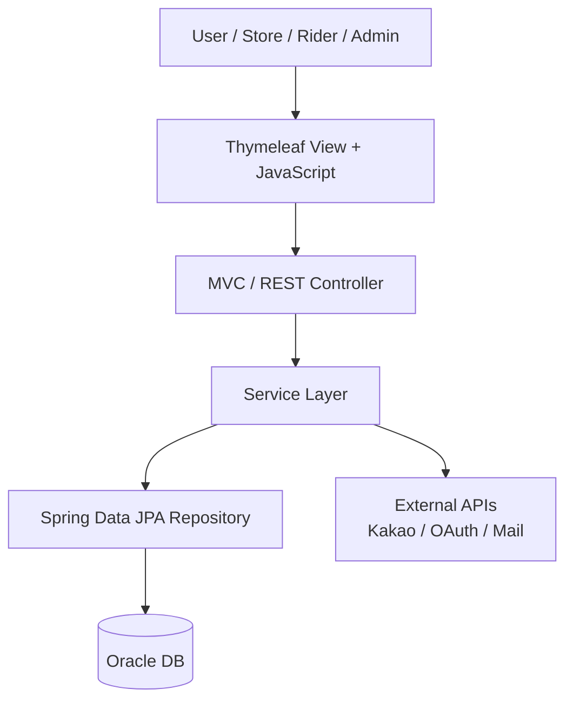

# DeliveryPro Portfolio

## Project Overview

DeliveryPro는 음식 주문, 매장 운영, 라이더 배달, 관리자 운영을 하나의 흐름으로 연결한 Spring Boot 기반 배달 플랫폼입니다. 사용자는 매장을 조회하고 주문할 수 있으며, 매장 관리자는 메뉴와 주문을 관리하고, 라이더는 배달 상태를 처리합니다. 관리자는 회원, 매장, 라이더, 쿠폰, 광고, 문의, 통계 데이터를 운영할 수 있습니다.

이 프로젝트는 단순 CRUD를 넘어 실제 서비스에 가까운 운영 흐름을 구현하는 데 초점을 두었습니다. 사용자 화면, 관리자 화면, REST API, Thymeleaf 기반 서버 렌더링, Oracle DB 연동, 외부 API 연동, 세션 기반 인증 흐름이 함께 구성되어 있습니다.

## Tech Stack

| Area | Stack |
| --- | --- |
| Language | Java 21 |
| Backend | Spring Boot 3.4, Spring MVC, Spring Data JPA |
| View | Thymeleaf, JavaScript |
| Database | Oracle DB |
| Auth / Integration | OAuth2 Client, Java Mail, Kakao API |
| Build / Test | Gradle, JUnit 5, Spring Boot Test |

## Main Features

### Member

- 회원가입, 로그인, 소셜 로그인 흐름
- 마이페이지, 배송지, 포인트, 등급 관리
- 주문 내역과 QnA 조회

### Store

- 매장 등록 및 승인 요청
- 메뉴 등록, 수정, 삭제
- 주문 접수와 매출 관리
- 리뷰 조회와 답변 관리

### Order

- 장바구니 기반 주문 생성
- 주문 상태 변경
- 주문 상세 및 결제 흐름 처리

### Rider

- 라이더 가입 및 관리자 승인
- 배달 가능 상태 관리
- 배달 지도 화면과 위치 기반 기능 연동

### Admin

- 회원, 매장, 라이더 운영 관리
- 쿠폰과 광고 관리
- 게시판 문의 답변 처리
- 매출, 마케팅, 대시보드 통계 조회

## Architecture



## Implementation Highlights

### 1. Standardized API Response

REST API 응답은 공통 `ApiResponse` 구조로 통일했습니다. 프론트엔드 JavaScript에서는 성공 여부와 실제 데이터를 일관된 방식으로 처리할 수 있어, 화면별 응답 파싱 로직의 중복을 줄였습니다.

### 2. Domain-Centered Package Structure

회원, 주문, 매장, 라이더, 쿠폰, 알림, 배송지, 로그인 이력 등 주요 기능을 도메인 단위로 나누어 관리했습니다. 각 도메인은 Controller, Service, Repository, DTO, Entity를 중심으로 구성되어 기능별 변경 범위를 명확히 했습니다.

### 3. Business Exception Flow

존재하지 않는 리소스, 잘못된 요청, 중복 처리 같은 비즈니스 오류는 `BusinessException`과 `ErrorCode`로 표현했습니다. 이를 통해 실패 상황이 단순 `null`이나 문자열 응답으로 흐르지 않고, 의미 있는 예외 흐름으로 관리됩니다.

### 4. Transaction Boundary Management

조회 메서드에는 `@Transactional(readOnly = true)`, 생성/수정/삭제 메서드에는 기본 `@Transactional`을 적용했습니다. 서비스 계층이 비즈니스 처리와 트랜잭션 경계를 담당하도록 구성했습니다.

### 5. Admin Operation Flow

관리자 화면에서는 회원, 매장, 라이더, 게시글, 쿠폰, 광고 데이터를 운영할 수 있습니다. 특히 매장/라이더 승인, 게시판 답변 등록, 쿠폰 발급, 광고 관리처럼 실제 운영자가 반복적으로 사용하는 흐름을 기준으로 화면과 API를 연결했습니다.

## Problem Solving

| Problem | Solution |
| --- | --- |
| API별 응답 형식이 달라 JavaScript 처리 방식이 흩어짐 | `ApiResponse` 구조로 성공/실패 응답을 통일 |
| 일부 서비스에서 `null` 또는 단순 boolean으로 실패를 표현 | `BusinessException` 기반으로 실패 원인을 명확히 표현 |
| Controller가 트랜잭션 책임을 일부 갖는 구조 | Service 계층 중심으로 트랜잭션 경계 정리 |
| 관리자 기능의 실패 흐름이 사용자 화면에 자연스럽게 연결되지 않음 | 예외를 잡아 적절한 리다이렉트 또는 화면 재표시로 처리 |
| 로컬 실행에 민감 정보가 직접 필요함 | 환경변수 기반 설정으로 분리 |

## Verification

아래 명령으로 빌드와 테스트를 확인했습니다.

```powershell
.\gradlew.bat compileJava
.\gradlew.bat test
```

검증 결과:

- Java 컴파일 성공
- Spring Boot 테스트 성공
- Git staged diff whitespace check 성공

## What I Can Explain In An Interview

- Spring MVC에서 Controller와 Service의 책임을 어떻게 나누었는지
- REST API 응답 구조를 통일하면 프론트엔드 처리에 어떤 장점이 생기는지
- `BusinessException`과 `ErrorCode`를 사용해 실패 흐름을 관리한 이유
- JPA 기반 서비스에서 read-only 트랜잭션을 구분한 이유
- 관리자 운영 기능을 실제 업무 흐름 기준으로 구성한 방식
- 배달 플랫폼 도메인을 회원, 주문, 매장, 라이더, 관리자 기능으로 나눈 기준

## Future Improvements

- JWT 기반 인증으로 세션 의존도 낮추기
- 관리자 REST API와 사용자 REST API 문서화
- Docker Compose 기반 로컬 실행 환경 구성
- 테스트 커버리지 확대
- 프론트엔드와 백엔드 분리 구조로 확장

## Summary

DeliveryPro는 음식 배달 서비스의 핵심 흐름을 구현한 웹 애플리케이션입니다. 주문, 매장 운영, 라이더 배달, 관리자 운영 기능을 Spring Boot와 Oracle DB 기반으로 구성했으며, 공통 응답 구조, 예외 처리, 트랜잭션 경계, 도메인별 패키지 구성을 통해 유지보수하기 쉬운 구조로 정리했습니다.
