# DeliveryPro

<div align="center">

## 음식 주문부터 라이더 배달, 매장 운영, 관리자 통계까지 연결한 배달 플랫폼

**Spring Boot 기반 음식 배달 서비스 포트폴리오 프로젝트**

<br/>


<br/>
<br/>

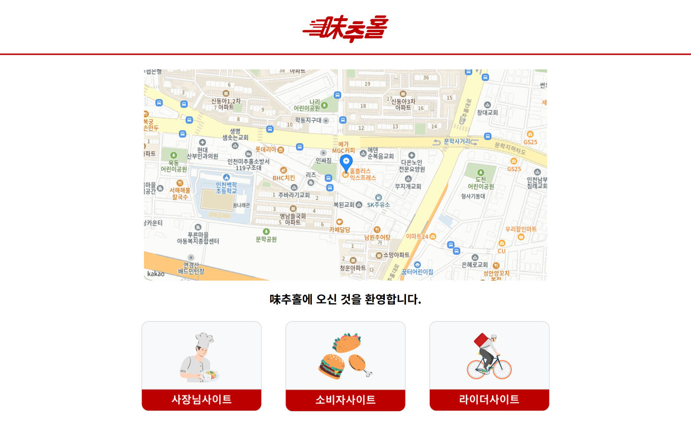

</div>

---

## 프로젝트 소개

**DeliveryPro**는 음식 주문, 매장 운영, 라이더 배달, 관리자 운영을 하나의 서비스 흐름으로 연결한 음식 배달 플랫폼입니다.

사용자는 매장을 조회하고 메뉴를 주문할 수 있으며, 매장 운영자는 주문 접수와 메뉴 관리를 수행합니다. 라이더는 배달 업무를 확인하고 배달 상태를 변경할 수 있고, 관리자는 회원, 매장, 라이더, 쿠폰, 광고, 문의, 통계 데이터를 운영합니다.

| 사용자 유형 | 서비스 흐름 |
| --- | --- |
| 일반 사용자 | 회원가입/로그인 → 매장 조회 → 장바구니 → 주문/결제 → 마이페이지 |
| 매장 운영자 | 매장 등록 → 메뉴 관리 → 주문 접수 → 리뷰/매출 관리 |
| 라이더 | 라이더 가입 → 관리자 승인 → 배달 업무 확인 → 배달 상태 변경 |
| 관리자 | 회원/매장/라이더 관리 → 쿠폰/광고 운영 → QnA 답변 → 통계 확인 |

---

## 서비스 화면

아래는 전부 `h2` 프로파일로 직접 띄워 찍은 화면입니다. 데모 데이터가 그대로 들어 있어
클론 후 같은 화면을 재현할 수 있습니다. 실행 방법은 아래 "1분 만에 실행" 절을 보세요.

### 진입 화면

역할이 셋이라 첫 화면에서 갈립니다. 지도는 카카오 지도 SDK이고, 배달 권역 기준점을 보여줍니다.


### 고객 메인

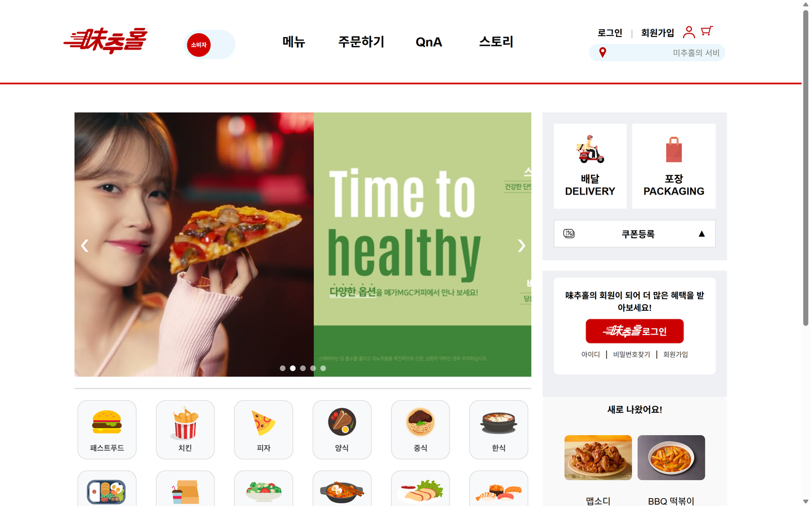

### 매장 목록

카테고리 12종으로 나뉘고, 별점과 리뷰 수, 최소 주문 금액, 예상 배달 시간을 함께 보여줍니다.

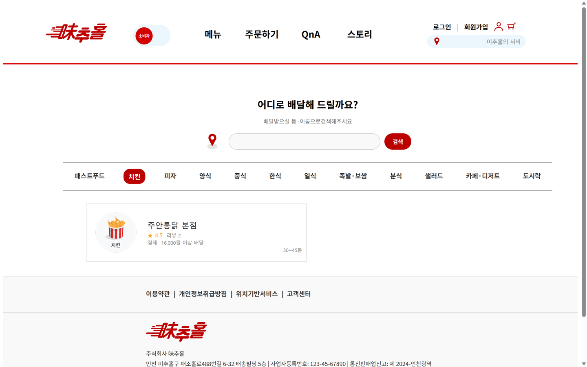

### 매장 상세와 주문

메뉴, 리뷰, 정보 탭으로 나뉘고 오른쪽 주문표에 담은 항목이 쌓입니다.

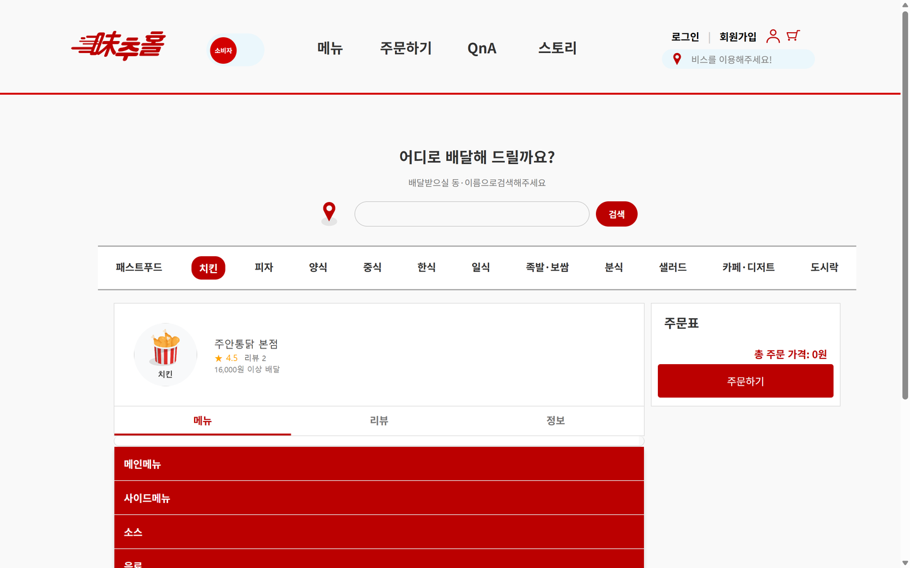

### 로그인

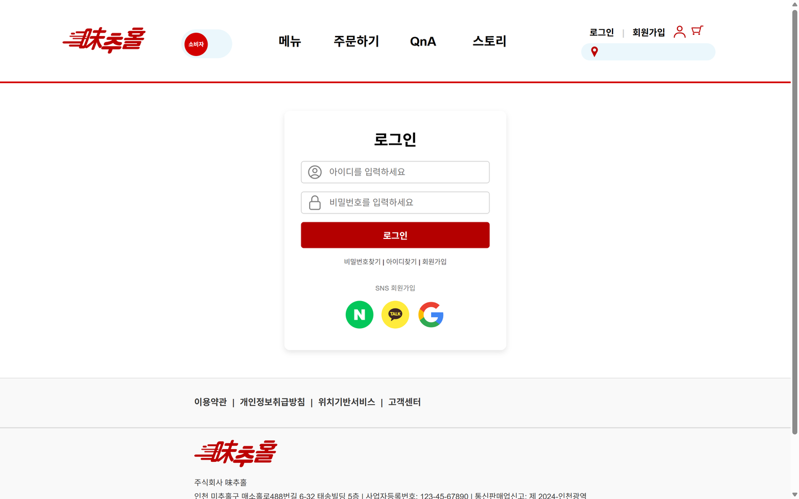

### 마이페이지

리워드 등급과 포인트, 주문 내역, 리뷰 관리, 배송지 관리를 한곳에 둡니다.

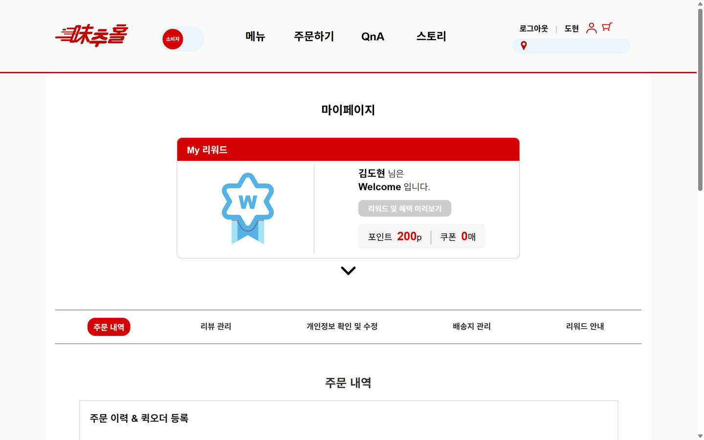

### 관리자 페이지

회원, 매장, 라이더, 알림, 통계를 좌측 메뉴로 나눴습니다. 아래는 승인된 매장 목록입니다.

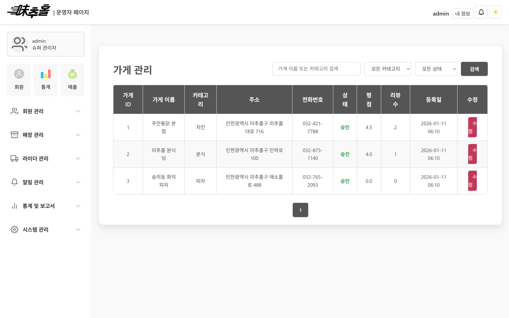

### 매장 관리 페이지

사장님 계정 하나에 매장을 최대 3개까지 붙일 수 있습니다.

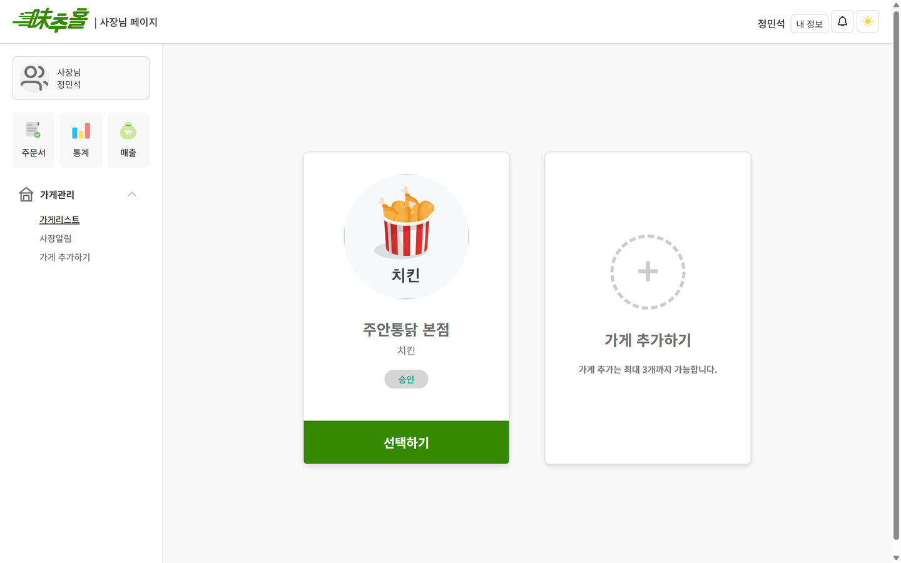

### 라이더 페이지

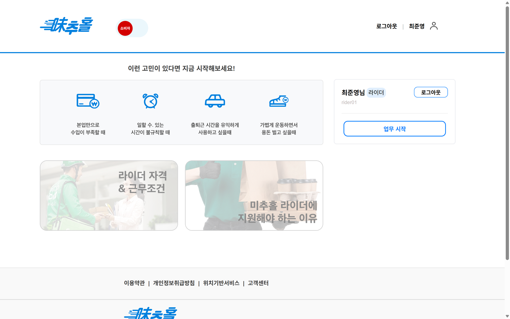

---

## 주요 기능

### 사용자 기능

| 기능 | 설명 |
| --- | --- |
| 회원가입 / 로그인 | 일반 회원 가입과 로그인 흐름 구현 |
| OAuth2 소셜 로그인 | Google, Naver, Kakao 로그인 연동 |
| 이메일 인증 | 회원 인증을 위한 메일 발송 기능 |
| 매장 조회 | 음식 카테고리와 매장 상세 정보 조회 |
| 장바구니 | 메뉴 담기, 수량 변경, 주문 전 확인 |
| 마이페이지 | 회원 정보, 등급, 포인트, 쿠폰, 주문 내역 확인 |
| QnA | 문의 등록과 답변 조회 |

### 주문 기능

| 기능 | 설명 |
| --- | --- |
| 주문 생성 | 장바구니 기반 주문 생성 |
| 주문 상세 | 주문 상품, 금액, 상태 정보 조회 |
| 주문 상태 관리 | 접수, 진행, 완료 등 주문 상태 흐름 처리 |
| 리뷰 작성 | 주문 이후 리뷰 등록 및 조회 |

### 매장 기능

| 기능 | 설명 |
| --- | --- |
| 매장 등록 | 사장님 계정 기반 매장 등록 요청 |
| 메뉴 관리 | 메뉴 추가, 수정, 삭제, 품절 처리 |
| 주문 접수 | 매장 주문 확인과 주문 상태 변경 |
| 매출 관리 | 매장별 주문 및 매출 통계 확인 |
| 리뷰 관리 | 사용자 리뷰 확인과 답변 관리 |

### 라이더 기능

| 기능 | 설명 |
| --- | --- |
| 라이더 가입 | 라이더 등록 요청 및 관리자 승인 흐름 |
| 배달 상태 관리 | 배달 가능 여부와 진행 상태 처리 |
| 배달 업무 화면 | 배달 요청 확인과 업무 진행 |
| 지도 기능 | Kakao 지도 API 기반 위치 기능 연동 |

### 관리자 기능

| 기능 | 설명 |
| --- | --- |
| 회원 관리 | 회원 목록, 등급, 상태, 로그인 이력 관리 |
| 매장 관리 | 매장 등록 요청 승인과 매장 리스트 관리 |
| 라이더 관리 | 라이더 등록 요청 승인과 라이더 상태 관리 |
| 쿠폰 관리 | 쿠폰 생성, 발급, 사용 내역 조회 |
| 광고 관리 | 광고 등록과 노출 관리 |
| 문의 관리 | QnA 조회, 답변 등록, 답변 상태 변경 |
| 통계 대시보드 | 매출, 주문, 회원, 마케팅 통계 확인 |

### 지도 / 외부 API 기능

| 기능 | 설명 |
| --- | --- |
| Kakao 지도 API | 위치 기반 지도 기능 연동 |
| OAuth2 로그인 | Google, Naver, Kakao 계정 로그인 |
| Java Mail Sender | 이메일 인증 메일 발송 |

---

## 주문부터 배달까지의 흐름

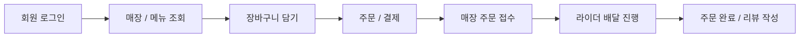

---

## ERD / 주요 테이블 설계

서비스의 핵심 데이터는 회원, 매장, 메뉴, 주문, 라이더, 쿠폰, 리뷰, QnA, 관리자 운영 데이터를 중심으로 구성했습니다.

```mermaid
erDiagram
    MEMBER {
        long mem_id PK "회원 PK"
        string mem_userid "회원 아이디"
        string mem_email "회원 이메일"
        string mem_username "회원 이름"
        string mem_nickname "닉네임"
        string mem_phone "전화번호"
        long mem_point "포인트"
        string mem_grade "회원 등급"
        string mem_status "회원 상태"
        string mem_login_type "로그인 타입"
    }

    PRE_MEMBER {
        long pre_mem_id PK "사장 회원 PK"
        string pre_mem_biz_reg_no "사업자 등록번호"
        string pre_mem_ceo_name "대표자명"
        string pre_mem_user_id "아이디"
        string pre_mem_email "이메일"
        string pre_mem_status "상태"
        string pre_mem_approval_status "승인 상태"
    }

    PRE_STORE {
        long pre_sto_id PK "가게 PK"
        long pre_sto_pre_mem_id FK "사장 회원 FK"
        string pre_sto_name "가게명"
        string pre_sto_category "카테고리"
        string pre_sto_address "주소"
        string pre_sto_phone "전화번호"
        int pre_sto_min_order_amount "최소 주문 금액"
        int pre_sto_delivery_fee "배달비"
        string pre_sto_status "상태"
    }

    PRE_STORE_MENU {
        long menu_id PK "메뉴 PK"
        long pre_sto_id FK "가게 FK"
        string menu_category "메뉴 카테고리"
        string menu_name "메뉴명"
        int menu_price "가격"
        string menu_status "상태"
        string menu_description "메뉴 설명"
    }

    CART {
        long cart_id PK "장바구니 PK"
        long mem_id FK "회원 FK"
        long menu_id FK "메뉴 FK"
        string cart_name "메뉴명"
        int cart_item_price "가격"
        int cart_quantity "수량"
    }

    ORDERS {
        long order_id PK "주문 PK"
        long pre_sto_id FK "가게 FK"
        long mem_id FK "회원 FK"
        string order_status "주문 상태"
        int order_total_price "총 금액"
        string payment_method "결제 방식"
        string delivery_type "배달 유형"
        string delivery_status "배달 상태"
        int delivery_fee "배달비"
        int discount_amount "할인 금액"
    }

    ORDERITEM {
        long order_item_id PK "주문 상품 PK"
        long order_id FK "주문 FK"
        long menu_id FK "메뉴 FK"
        string item_name "상품명"
        int quantity "수량"
        int item_price "상품 가격"
        int total_price "총 가격"
    }

    RIDERS {
        long rider_no PK "라이더 PK"
        string rider_id "라이더 아이디"
        string rider_name "이름"
        string rider_phone "전화번호"
        string vehicle_type "차량 종류"
        int total_deliveries "총 배달 수"
        string is_available "배달 가능 여부"
    }

    DELIVERY_GROUP {
        long delivery_id PK "배달 그룹 PK"
        long rider_no FK "라이더 FK"
        long store_id FK "가게 FK"
        string delivery_type "배달 유형"
        string delivery_status "배달 상태"
        int delivery_fee "배달비"
        datetime call_time "배차 시간"
    }

    DELIVERY_GROUP_ITEM {
        long delivery_id FK "배달 그룹 FK"
        long order_id FK "주문 FK"
        int order_sequence "배달 순서"
        string store_address "가게 주소"
        string destination_address "목적지 주소"
    }

    REVIEWS {
        long review_id PK "리뷰 PK"
        long order_id FK "주문 FK"
        long pre_sto_id FK "가게 FK"
        long mem_id FK "회원 FK"
        int review_rating "평점"
        string review_content "리뷰 내용"
        string review_image "리뷰 이미지"
    }

    COUPONS {
        long cpn_id PK "쿠폰 PK"
        string cpn_code "쿠폰 코드"
        string cpn_name "쿠폰명"
        int cpn_deduct_price "할인 금액"
        int cpn_min_price "최소 주문 금액"
        string cpn_status "쿠폰 상태"
        datetime cpn_expired "만료일"
    }

    COUPON_USAGES {
        long usage_id PK "사용 이력 PK"
        long cpn_id FK "쿠폰 FK"
        long mem_id FK "회원 FK"
        datetime used_at "사용일"
    }

    BOARDS {
        long board_id PK "게시글 PK"
        long mem_id FK "회원 FK"
        string board_title "제목"
        string board_content "내용"
        string board_answer_status "답변 상태"
    }

    COMMENTS {
        long comment_id PK "댓글 PK"
        long review_id FK "리뷰 FK"
        long board_id FK "게시글 FK"
        long admin_id FK "관리자 FK"
        string comment_contents "댓글 내용"
        datetime comment_date "작성일"
    }

    ADMIN {
        long admin_id PK "관리자 PK"
        string admin_username "관리자 아이디"
        string admin_email "관리자 이메일"
        string admin_role "관리자 권한"
        string admin_status "상태"
    }

    ADVERTISEMENTS {
        long adv_id PK "광고 PK"
        int adv_order "광고 순서"
        string adv_title "광고 제목"
        string adv_image_url "광고 이미지"
    }

    NOTIFICATIONS {
        long id PK "알림 PK"
        string sender_type "발신자 타입"
        long sender_id "발신자 ID"
        string recipient_type "수신자 타입"
        long recipient_id "수신자 ID"
        string category "알림 카테고리"
        string status "읽음 상태"
    }

    LOGIN_HISTORY {
        long his_login_id PK "로그인 기록 PK"
        long his_mid FK "회원 FK"
        datetime his_login_date "로그인 일시"
        string his_ip_address "IP 주소"
        string his_device_os "운영체제"
        string his_browser "브라우저"
    }

    MEMBER ||--o{ CART : has
    MEMBER ||--o{ ORDERS : places
    MEMBER ||--o{ REVIEWS : writes
    MEMBER ||--o{ BOARDS : asks
    MEMBER ||--o{ COUPON_USAGES : uses
    MEMBER ||--o{ DELIVERY_ADDRESS : owns
    MEMBER ||--o{ LOGIN_HISTORY : records

    PRE_MEMBER ||--o{ PRE_STORE : owns
    PRE_STORE ||--o{ PRE_STORE_MENU : has
    PRE_STORE ||--o{ ORDERS : receives
    PRE_STORE ||--o{ REVIEWS : gets

    ORDERS ||--o{ ORDERITEM : contains
    PRE_STORE_MENU ||--o{ ORDERITEM : ordered
    PRE_STORE_MENU ||--o{ CART : selected

    RIDERS ||--o{ DELIVERY_GROUP : handles
    DELIVERY_GROUP ||--o{ DELIVERY_GROUP_ITEM : includes
    ORDERS ||--o{ DELIVERY_GROUP_ITEM : assigned

    COUPONS ||--o{ COUPON_USAGES : issued
    BOARDS ||--o{ COMMENTS : answered
    ADMIN ||--o{ COMMENTS : writes
    ADMIN ||--o{ ADVERTISEMENTS : manages
```

### 주요 테이블

| 테이블 | 역할 |
| --- | --- |
| `MEMBER` | 일반 사용자 계정, 등급, 상태, 마이페이지 정보 |
| `PRE_MEMBER` | 매장 운영자 계정 |
| `PRE_STORE` | 매장 기본 정보, 영업 정보, 승인 상태 |
| `PRE_STORE_MENU` | 매장 메뉴, 가격, 품절 상태 |
| `CART` | 사용자 장바구니 |
| `ORDER` | 주문 기본 정보, 주문 상태, 결제 금액 |
| `ORDER_ITEM` | 주문에 포함된 메뉴 상세 |
| `RIDER` | 라이더 계정과 배달 가능 상태 |
| `DELIVERY_GROUP` | 라이더 배달 묶음과 배정 정보 |
| `REVIEW` | 주문 후 작성되는 리뷰 |
| `COUPON` | 쿠폰 정보 |
| `COUPON_USAGE` | 쿠폰 발급 및 사용 이력 |
| `BOARD` | 사용자 QnA 문의 |
| `COMMENT` | 관리자 QnA 답변 |
| `ADMIN` | 관리자 계정 |
| `ADVERTISEMENT` | 광고 등록 및 노출 정보 |
| `NOTIFICATION` | 사용자/매장/라이더 알림 |
| `LOGIN_HISTORY` | 로그인 이력 |

---

## 시스템 구조

DeliveryPro는 Spring MVC 기반 서버 렌더링 구조로 구성했습니다. 화면은 Thymeleaf와 JavaScript로 구성하고, 비즈니스 로직은 Service 계층에서 처리하며, 데이터는 Spring Data JPA를 통해 Oracle DB와 연결합니다.

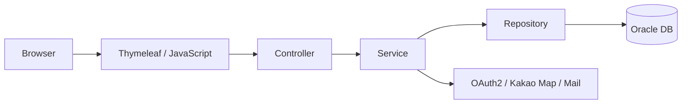

---

## 기술적 의사결정

| 결정 | 선택한 이유 | 고려한 대안 | 트레이드오프 |
| --- | --- | --- | --- |
| MVC 서버 렌더링 | 백엔드 중심 프로젝트에서 화면과 기능 흐름을 빠르게 연결하고, 주문/관리자 화면을 한 프로젝트 안에서 확인하기 위해 선택했습니다. | REST API + SPA | 프론트엔드 분리 확장성은 낮지만, Spring MVC 요청 흐름과 서버 렌더링 구조를 명확히 보여줄 수 있습니다. |
| `MEMBER`와 `PRE_MEMBER` 분리 | 일반 사용자와 매장 운영자는 가입 정보, 승인 정책, 화면 흐름이 달라 별도 테이블로 관리했습니다. | 단일 회원 테이블 + role 컬럼 | 공통 필드 중복은 생기지만, 역할별 승인/운영 정책을 명확하게 분리할 수 있습니다. |
| Oracle DB 사용 | 관계형 모델, FK 제약조건, SQL 스크립트 기반 스키마 관리 경험을 쌓기 위해 선택했습니다. | MySQL, PostgreSQL, H2 | 로컬 실행 준비는 무겁지만 실제 RDB 기반 서비스 구조를 연습할 수 있습니다. |

---

## 트러블슈팅

### 1. 세션 기반 인증과 Spring Security 설정 충돌

| 항목 | 내용 |
| --- | --- |
| 문제 상황 | 직접 구현한 세션 로그인 흐름과 Spring Security 기본 인증 흐름이 함께 적용되면서 일부 페이지 접근이 예상과 다르게 처리되었습니다. |
| 원인 분석 | 프로젝트는 세션에 사용자 정보를 저장해 화면 접근을 제어했지만, Spring Security 자동 설정도 기본 보안 필터를 적용했습니다. |
| 해결 방법 | 개발 단계에서는 Security 자동 설정을 조정하고, 화면별 세션 체크 흐름을 명확히 분리했습니다. |
| 배운 점 | 인증 방식은 프로젝트 초기에 기준을 정하고, 세션/필터/권한 체크 책임을 분리해야 유지보수가 쉬워집니다. |

### 2. OAuth2 제공자별 사용자 정보 매핑

| 항목 | 내용 |
| --- | --- |
| 문제 상황 | Google, Naver, Kakao 로그인 응답 구조가 달라 동일한 방식으로 회원 정보를 저장하기 어려웠습니다. |
| 원인 분석 | 제공자마다 email, nickname, profile 정보의 위치와 key가 달라 내부 회원 모델과 직접 매핑하기 어려웠습니다. |
| 해결 방법 | 로그인 타입을 구분하고, 제공자별 응답을 내부 회원 DTO/Entity에 맞게 변환하는 흐름을 분리했습니다. |
| 배운 점 | 소셜 로그인은 인증 성공보다 “외부 프로필을 내부 회원 정책에 맞게 연결하는 과정”이 중요합니다. |

### 3. 주문 상태와 배달 상태의 책임 분리

| 항목 | 내용 |
| --- | --- |
| 문제 상황 | 주문 접수, 매장 처리, 라이더 배달 진행 상태가 하나의 상태처럼 섞이면 화면별 상태 표시와 변경 로직이 복잡해졌습니다. |
| 원인 분석 | 주문 상태는 매장 중심으로 변경되고, 배달 상태는 라이더 업무 흐름에서 변경됩니다. |
| 해결 방법 | 주문 테이블의 주문 상태와 배달 그룹의 배달 상태를 분리하고 각 화면에서 필요한 상태만 변경하도록 구성했습니다. |
| 배운 점 | 상태 값은 “누가 변경하는가”와 “어느 화면에서 사용되는가”를 기준으로 나누는 것이 좋습니다. |

### 4. 관리자 QnA 답변 중복 등록

| 항목 | 내용 |
| --- | --- |
| 문제 상황 | 관리자가 같은 문의에 답변을 중복 등록할 수 있는 흐름이 발생할 수 있었습니다. |
| 원인 분석 | 게시글과 답변 관계에서 이미 답변이 존재하는지 확인하는 비즈니스 검증이 필요했습니다. |
| 해결 방법 | 답변 등록 전 기존 답변 존재 여부를 확인하고, 이미 답변이 있으면 중복 등록을 막도록 처리했습니다. |
| 배운 점 | 단순 CRUD처럼 보이는 기능도 실제 운영자의 반복 클릭과 재요청 상황을 고려해야 합니다. |

---

## 성능 및 보안 고려사항

| 구분 | 고려한 내용 |
| --- | --- |
| 역할별 접근 제어 | 사용자, 매장 운영자, 라이더, 관리자 화면을 분리하고 세션 정보를 기준으로 접근 흐름을 나누었습니다. |
| 세션 관리 | 로그인 성공 시 사용자 식별자와 역할 정보를 세션에 저장해 화면 접근과 기능 처리를 구분했습니다. |
| 민감 정보 관리 | DB, Mail, OAuth, Kakao API Key는 `application.properties`에 직접 작성하지 않고 환경 변수로 주입하도록 구성했습니다. |
| 쿼리 최적화 | 주문, 매장, 회원, 쿠폰처럼 목록 조회가 많은 기능은 페이징과 검색 조건을 사용해 조회 범위를 제한했습니다. |
| 인덱스 고려 | 회원 ID, 매장 ID, 주문 ID, 라이더 ID처럼 조인과 조회에 자주 사용되는 FK 컬럼은 인덱스 적용 대상입니다. |

---

## 기술 스택

| Category | Stack |
| --- | --- |
| Backend | Java 21, Spring Boot 3.4, Spring MVC |
| Database | Oracle DB, Spring Data JPA |
| Security | Spring Security, OAuth2 Client |
| Frontend | Thymeleaf, HTML, CSS, JavaScript |
| External API | Kakao Map API, Java Mail Sender |
| Build / Test | Gradle, JUnit 5, Spring Boot Test |
| Configuration | Spring Profiles, Environment Variables |

---

## 프로젝트 구조

```text
src/main/java/com/icia/delivery
├─ domain
│  ├─ member          # 회원, 로그인, 마이페이지
│  ├─ store           # 매장 조회와 매장 정보
│  ├─ storemenu       # 메뉴 관리
│  ├─ cart            # 장바구니
│  ├─ order           # 주문
│  ├─ rider           # 라이더와 배달
│  ├─ admin           # 관리자 운영 기능
│  ├─ coupon          # 쿠폰
│  ├─ review          # 리뷰
│  ├─ board           # QnA
│  └─ notification    # 알림
├─ global             # 공통 응답, 예외, 공통 서비스
└─ util               # 외부 API 유틸
```

---

## 1분 만에 실행

Oracle과 외부 API 키 없이 바로 띄울 수 있습니다. H2 인메모리로 뜨고, 기동할 때
데모 데이터가 자동으로 들어갑니다.

```bash
./gradlew bootRun --args='--spring.profiles.active=h2'
```

`http://localhost:9090/index` 로 들어가면 됩니다. 데이터베이스 콘솔은 `/h2` 입니다.

| 역할 | 아이디 | 비밀번호 | 로그인 경로 |
| :--- | :--- | :--- | :--- |
| 관리자 | `admin` | `admin1234` | `/admin` |
| 일반 회원 | `user01` | `user1234` | `/mLoginForm` |
| 사장님 | `boss01` | `boss1234` | `/pLoginForm` |
| 라이더 | `rider01` | `rider1234` | `/rLoginForm` |

데모 데이터는 매장 4곳(승인 3, 승인대기 1), 메뉴 17개, 주문 5건, 리뷰 3건, 회원 2명,
라이더 2명입니다. 주문은 픽업중, 배차중, 배달중, 배달완료로 상태를 서로 다르게 넣어
관리자와 사장님 화면에서 각각 다른 목록이 뜨도록 했습니다.

시더는 `global/config/DemoDataSeeder.java` 이고 `@Profile("h2")` 라 운영 프로파일에는
영향이 없습니다. 회원 테이블에 데이터가 있으면 시딩을 건너뜁니다.

지도까지 보려면 카카오 JavaScript 키를 환경변수로 주면 됩니다. 없어도 나머지 화면은 전부
동작하고, 첫 화면의 지도 자리만 빕니다. 카카오 디벨로퍼스에서 JS SDK 도메인에
`http://localhost:9090` 을 등록해야 키가 먹습니다.

```bash
KAKAO_JAVASCRIPT_KEY=발급받은키 ./gradlew bootRun --args='--spring.profiles.active=h2'
```

> H2 접속 URL에 `MODE=Oracle` 을 붙였습니다. 엔티티 6개가 `columnDefinition` 에
> `TRUNC(SYSDATE)` 같은 Oracle 전용 표현을 직접 갖고 있어 일반 모드에서는 테이블 생성이
> 실패합니다.

---

## 실행 방법 (Oracle)

운영과 같은 구성으로 띄울 때만 필요합니다.

### 1. JDK 21 설치 확인

```powershell
java -version
```

### 2. Oracle DB 설정

`docs/sql` 폴더의 SQL 파일을 사용해 테이블과 제약조건을 구성합니다.

```text
docs/sql/DDL.sql
docs/sql/FK_CONSTRAINT.sql
docs/sql/COMMENT.sql
```

### 3. 환경 변수 설정

```powershell
$env:DB_URL="jdbc:oracle:thin:@localhost:1521/XEPDB1"
$env:DB_USERNAME="your_db_username"
$env:DB_PASSWORD="your_db_password"

$env:MAIL_USERNAME="your_mail@example.com"
$env:MAIL_PASSWORD="your_mail_app_password"

$env:NAVER_CLIENT_ID="your_naver_client_id"
$env:NAVER_CLIENT_SECRET="your_naver_client_secret"

$env:GOOGLE_CLIENT_ID="your_google_client_id"
$env:GOOGLE_CLIENT_SECRET="your_google_client_secret"

$env:KAKAO_CLIENT_ID="your_kakao_client_id"
$env:KAKAO_CLIENT_SECRET="your_kakao_client_secret"
$env:KAKAO_API_KEY="your_kakao_rest_api_key"
$env:KAKAO_JAVASCRIPT_KEY="your_kakao_javascript_key"
```

### 4. 애플리케이션 실행

```powershell
.\gradlew.bat bootRun
```

```text
http://localhost:9090
```

### 5. 테스트 실행

```powershell
.\gradlew.bat test
```

---

## 개발 포인트

- 사용자, 매장, 라이더, 관리자 역할별 서비스 흐름 구현
- 주문 생성부터 매장 접수, 라이더 배달까지 이어지는 배달 플랫폼 프로세스 구성
- OAuth2 소셜 로그인, 이메일 인증, Kakao 지도 API 등 외부 기능 연동
- 관리자 페이지에서 승인, 쿠폰, 광고, 문의 답변, 통계 기능 제공
- 공통 응답과 예외 흐름을 정리해 API 응답 처리 일관성 개선

---

## 향후 개선 계획

| 개선 항목 | 방향 |
| --- | --- |
| Service 계층 세션 의존 제거 | 세션 접근을 Controller 또는 인증 컨텍스트로 모으고 Service는 파라미터 기반으로 동작하도록 개선 |
| REST API 분리 | Thymeleaf 화면과 REST API를 분리해 SPA 또는 모바일 클라이언트 확장 가능성 확보 |
| 테스트 커버리지 향상 | 주문, 쿠폰, 배달 상태 변경 등 핵심 비즈니스 로직 단위 테스트 추가 |
| 배달 상태 동시성 제어 | 동일 주문에 대한 중복 배정/상태 변경을 방지하기 위한 상태 전이 검증 강화 |
| Docker Compose 구성 | Oracle DB와 애플리케이션 실행 환경을 컨테이너로 구성해 로컬 실행 난이도 감소 |

---

## 팀과 기여

인천일보아카데미 과정에서 5명이 만든 팀 프로젝트입니다. 저는 조장을 맡아 일정과 코드 리뷰를
관리하면서 서버의 공통 규약과 소셜 로그인, 화면 전반을 담당했습니다.

### 기여 근거에 대한 고지

이 저장소는 팀 작업을 끝낸 뒤 한 번에 올린 것입니다. 커밋이 전부 업로드 이후 시점이고
작성자 이메일도 하나뿐이라, **git 이력만으로는 팀원별 기여가 구분되지 않습니다.** 아래 담당
내역은 코드와 화면으로 설명한 것이고 커밋 이력이 이를 뒷받침하지는 않습니다. 확인이 필요하면
해당 파일을 직접 열어 보시면 됩니다.

### 제가 맡은 부분

**공통 응답과 예외 규약**
성공과 실패 응답 형태를 `ApiResponse` 하나로 통일하고, HTTP 상태와 코드, 메시지를 묶은
`ErrorCode` 8종과 `BusinessException` 을 `@RestControllerAdvice` 로 연결했습니다. 예외를 던지는
지점이 81곳입니다. 이름이 같은 구 핸들러가 남아 있어 bean name을 따로 주고 `@RestController` 가
붙은 것에만 걸리도록 범위를 좁혔습니다.
`global/response/ApiResponse.java` `global/exception/ErrorCode.java` `global/exception/GlobalExceptionHandler.java`

**트랜잭션 경계 정리**
트랜잭션을 컨트롤러에서 서비스 계층으로 옮기고 조회 메서드에 `readOnly` 를 붙였습니다.
전체 165곳 중 91곳이 조회 전용이고, `spring.jpa.open-in-view=false` 로 지연 로딩 범위도
서비스 안으로 제한했습니다.

**소셜 로그인 3사 직접 구현**
네이버, 구글, 카카오의 인가코드 교환과 프로필 조회를 라이브러리 없이 `HttpClient` 로
구현했습니다. 제공자마다 응답 구조가 달라 카카오는 `kakao_account` 하위 필드까지 따로
파싱했습니다. 회원, 사장, 라이더 세 계정 도메인 모두 BCrypt로 저장합니다.
`domain/member/service/AuthService.java`

**묶음배달 도메인**
라이더 한 명이 여러 주문을 묶는 `delivery_group` / `delivery_group_item` 2단 구조를 설계하고,
방문 순서는 Nearest Neighbor 휴리스틱으로 계산해 저장합니다. 최적해가 아니라 근사입니다.
`domain/order/service/OrderService.java`

**외부 의존 제거**
접속 IP를 외부 API로 조회하던 것을 걷어내고 요청 헤더에서 뽑도록 바꿨습니다.
`X-Forwarded-For` 부터 `RemoteAddr` 까지 5단으로 폴백하고, 프록시 체인과 헤더 부재 같은
경계를 테스트 10건으로 덮었습니다.
`global/service/IpService.java` `src/test/java/.../IpServiceTest.java`

**화면**
Thymeleaf 템플릿 101개를 전부 서버 바인딩으로 만들고, CSS 95개 파일 19,944줄과 JS 38개 파일
11,218줄을 프레임워크 없이 직접 작성해 역할별 레이아웃 4종을 구성했습니다.

### 남은 과제

- 테스트가 11건뿐입니다. IP 추출 로직 외에는 사실상 없어서 고칠 때마다 화면을 직접 눌러
  확인했습니다.
- 도착 예정 시간이 카카오 API의 소요시간이 아니라 직선거리 기반 근사입니다.
- 헤더의 마이페이지 링크가 회원 ID 없이 `/myPage/` 로 걸려 있어 404가 납니다. 실제 매핑은
  `/myPage/{mId}` 입니다.

---

## Author

**Sanghyeok Lee** ([@SanghyeokLee-KR](https://github.com/SanghyeokLee-KR))
