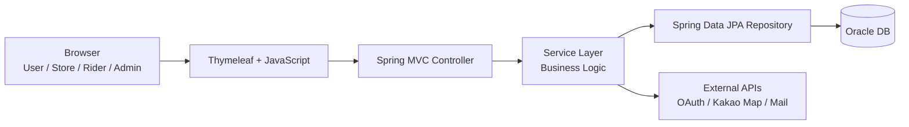

# 🚚 DeliveryPro

<div align="center">

## 배달 주문부터 라이더 배정, 매장 운영, 관리자 통계까지 연결한 음식 배달 플랫폼

Spring Boot와 Oracle DB를 기반으로 사용자, 매장, 라이더, 관리자 흐름을 구현한 백엔드 중심 웹 서비스입니다.

<br/>


<br/>
<br/>


</div>

---

## ✨ 프로젝트 소개

**DeliveryPro**는 음식 배달 서비스의 핵심 흐름을 웹 애플리케이션으로 구현한 프로젝트입니다.

사용자는 매장을 탐색하고 메뉴를 장바구니에 담아 주문할 수 있습니다. 매장 운영자는 주문 접수, 메뉴 관리, 리뷰 확인, 매출 조회를 처리할 수 있고, 라이더는 배달 업무와 상태를 관리합니다. 관리자는 회원, 매장, 라이더, 쿠폰, 광고, 문의, 통계 데이터를 운영합니다.

| 사용자 유형 | 주요 흐름 |
| --- | --- |
| 일반 사용자 | 회원가입/로그인 → 매장 조회 → 장바구니 → 주문/결제 → 마이페이지 |
| 매장 운영자 | 매장 등록 → 메뉴 관리 → 주문 접수 → 리뷰/매출 관리 |
| 라이더 | 라이더 가입 → 관리자 승인 → 배달 상태 관리 → 지도 기반 배달 |
| 관리자 | 회원/매장/라이더 관리 → 쿠폰/광고 운영 → 문의 답변 → 통계 확인 |

---

## ✅ 주요 기능

### 사용자 기능

| 기능 | 설명 |
| --- | --- |
| 회원가입 / 로그인 | 일반 회원 가입, 로그인, 세션 기반 사용자 흐름 처리 |
| 소셜 로그인 | Google, Naver, Kakao OAuth 로그인 연동 |
| 이메일 인증 | 회원가입 및 인증 흐름을 위한 메일 발송 기능 |
| 매장 조회 | 카테고리별 음식점 탐색과 매장 상세 조회 |
| 장바구니 | 메뉴 담기, 수량 변경, 주문 전 장바구니 관리 |
| 주문 / 결제 | 주문 생성, 주문 상세, 주문 상태 확인 |
| 마이페이지 | 회원 정보, 등급, 포인트, 쿠폰, 주문 내역 관리 |
| QnA | 사용자 문의 등록 및 답변 조회 |

### 매장 기능

| 기능 | 설명 |
| --- | --- |
| 매장 등록 | 사장님 계정 기반 매장 등록 요청 |
| 메뉴 관리 | 메뉴 추가, 수정, 삭제, 품절 처리 |
| 주문 관리 | 주문 접수와 주문 상태 변경 |
| 리뷰 관리 | 사용자 리뷰 조회 및 매장 답변 관리 |
| 매출 관리 | 매장별 매출과 주문 통계 확인 |
| 쿠폰 관리 | 매장 쿠폰 등록과 운영 |

### 라이더 기능

| 기능 | 설명 |
| --- | --- |
| 라이더 가입 | 라이더 등록 요청 및 관리자 승인 흐름 |
| 배달 상태 관리 | 배달 가능 여부와 업무 상태 관리 |
| 배달 화면 | 배달 업무 확인 및 진행 상태 처리 |
| 지도 기능 | Kakao 지도 API 기반 위치/경로 기능 연동 |

### 관리자 기능

| 기능 | 설명 |
| --- | --- |
| 회원 관리 | 회원 목록, 등급, 상태, 로그인 이력 관리 |
| 매장 관리 | 매장 등록 요청 승인, 매장 리스트 관리 |
| 라이더 관리 | 라이더 등록 요청 승인, 라이더 리스트 관리 |
| 쿠폰 관리 | 쿠폰 생성, 발급, 사용 내역 확인 |
| 광고 관리 | 관리자 광고 등록과 노출 관리 |
| 게시판 관리 | QnA 목록 조회, 답변 등록, 답변 상태 변경 |
| 통계 대시보드 | 매출, 회원 등급, 주문, 마케팅 통계 조회 |

---

## 🖼 서비스 화면

GitHub README에서 서비스 흐름을 바로 확인할 수 있도록 대표 화면 이미지를 `docs/images` 경로로 구성했습니다.

### 메인 페이지


### 주문 페이지


### 마이페이지


### 관리자 페이지


### 매장 관리 페이지


### 라이더 페이지


---

## 🏗 시스템 구조

DeliveryPro는 Spring MVC 기반의 서버 렌더링 웹 애플리케이션입니다. Controller는 요청과 화면 이동을 담당하고, Service는 비즈니스 로직과 트랜잭션 경계를 담당합니다. Repository는 Spring Data JPA를 통해 Oracle DB와 연결됩니다.



---

## 🛠 기술 스택

| 영역 | 기술 |
| --- | --- |
| Backend | Java 21, Spring Boot 3.4, Spring MVC, Spring Data JPA, Spring Validation |
| Frontend | Thymeleaf, HTML, CSS, JavaScript |
| Database | Oracle DB, JPA Entity, Repository |
| Auth / External | OAuth2 Client, Kakao API, Java Mail Sender |
| Build / Test | Gradle Wrapper, JUnit 5, Spring Boot Test |
| Configuration | Environment Variables, Spring Profiles |

---

## 📁 프로젝트 구조

```text
src/main/java/com/icia/delivery
├─ domain
│  ├─ admin              # 관리자, 통계, 쿠폰, 광고 운영
│  ├─ board              # QnA 게시판
│  ├─ cart               # 장바구니
│  ├─ coupon             # 쿠폰
│  ├─ deliveryaddress    # 배송지
│  ├─ deliverygroup      # 배달 그룹
│  ├─ member             # 회원, 로그인, 마이페이지
│  ├─ notification       # 알림
│  ├─ order              # 주문
│  ├─ president          # 사장님 계정
│  ├─ review             # 리뷰
│  ├─ reward             # 포인트/등급
│  ├─ rider              # 라이더
│  ├─ store              # 매장
│  └─ storemenu          # 메뉴
├─ global
│  ├─ exception          # 공통 예외 처리
│  ├─ response           # 공통 API 응답
│  └─ service            # 공통 서비스
└─ util                  # 외부 API 유틸
```

---

## 🚀 실행 방법

### 1. JDK 설치

Java 21을 사용합니다.

```powershell
java -version
```

### 2. Oracle DB 준비

Oracle DB를 실행한 뒤 `docs/sql` 폴더의 SQL 파일을 참고해 테이블과 제약조건을 구성합니다.

```text
docs/sql/DDL.sql
docs/sql/FK_CONSTRAINT.sql
docs/sql/COMMENT.sql
```

### 3. 환경 변수 설정

민감 정보는 `application.properties`에 직접 작성하지 않고 환경 변수로 주입합니다.

```powershell
$env:DB_URL="jdbc:oracle:thin:@localhost:1521/XEPDB1"
$env:DB_USERNAME="your_db_username"
$env:DB_PASSWORD="your_db_password"

$env:MAIL_USERNAME="your_mail@example.com"
$env:MAIL_PASSWORD="your_mail_app_password"

$env:NAVER_CLIENT_ID="your_naver_client_id"
$env:NAVER_CLIENT_SECRET="your_naver_client_secret"

$env:GOOGLE_CLIENT_ID="your_google_client_id"
$env:GOOGLE_CLIENT_SECRET="your_google_client_secret"

$env:KAKAO_CLIENT_ID="your_kakao_client_id"
$env:KAKAO_CLIENT_SECRET="your_kakao_client_secret"
$env:KAKAO_API_KEY="your_kakao_rest_api_key"
$env:KAKAO_JAVASCRIPT_KEY="your_kakao_javascript_key"
```

### 4. 애플리케이션 실행

```powershell
.\gradlew.bat bootRun
```

기본 포트는 `9090`입니다.

```text
http://localhost:9090
```

### 5. 빌드 및 테스트

```powershell
.\gradlew.bat compileJava
.\gradlew.bat test
```

---

## 🔎 구현 포인트

- 사용자, 매장, 라이더, 관리자 역할별 화면과 처리 흐름 구현
- Spring MVC + Thymeleaf 기반 서버 렌더링 구조 구성
- Oracle DB와 JPA Repository를 활용한 도메인 데이터 관리
- OAuth, 이메일, Kakao 지도 등 외부 연동 기능 구성
- 관리자 운영 화면에서 승인, 답변, 쿠폰, 광고, 통계 기능 제공
- 공통 응답/예외 흐름을 정리해 REST API 응답 처리 일관성 확보

---

## 💬 포트폴리오 관점에서 설명할 수 있는 부분

- 배달 플랫폼 도메인을 사용자/매장/라이더/관리자로 분리한 설계 기준
- Controller, Service, Repository 계층의 역할 분리
- 주문, 장바구니, 매장 관리, 라이더 배달 상태의 데이터 흐름
- 관리자 화면에서 운영자가 반복적으로 사용하는 업무 흐름 설계
- Spring Boot 프로젝트에서 환경 변수 기반 설정을 분리한 방식
- 외부 API 연동 시 서비스 계층과 유틸 클래스를 나누어 관리한 방식

---

## 🧭 개선 예정

- Docker Compose 기반 로컬 실행 환경 구성
- 화면별 실제 구동 스크린샷 추가
- 관리자 API 문서화
- 테스트 커버리지 확대
- JWT 기반 인증 구조로 확장

---

## 👤 Author

**Sanghyeok Lee**

Backend Developer Portfolio Project
