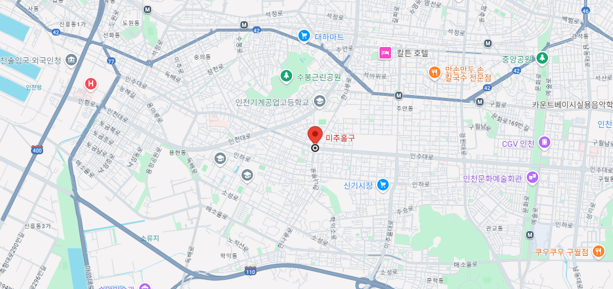
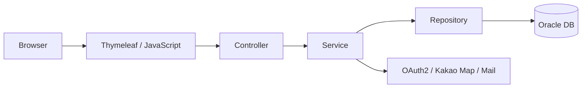

# 🚚 DeliveryPro

<div align="center">

## 음식 주문, 라이더 배달, 매장 운영, 관리자 기능을 연결한 배달 플랫폼

**Spring Boot 기반 음식 배달 서비스 포트폴리오 프로젝트**

<br/>


<br/>
<br/>



</div>

---

## 📌 프로젝트 소개

**DeliveryPro**는 음식 주문부터 배달 완료까지의 흐름을 구현한 웹 기반 배달 플랫폼입니다.

사용자는 매장을 둘러보고 메뉴를 주문할 수 있고, 매장 운영자는 주문과 메뉴를 관리할 수 있습니다. 라이더는 배달 업무와 상태를 처리하며, 관리자는 회원/매장/라이더/쿠폰/광고/문의/통계를 운영합니다.

| 사용자 | 서비스 흐름 |
| --- | --- |
| 일반 사용자 | 회원가입/로그인 → 매장 조회 → 장바구니 → 주문/결제 → 마이페이지 |
| 매장 운영자 | 매장 등록 → 메뉴 관리 → 주문 접수 → 리뷰/매출 관리 |
| 라이더 | 라이더 가입 → 관리자 승인 → 배달 업무 확인 → 배달 상태 변경 |
| 관리자 | 회원/매장/라이더 관리 → 쿠폰/광고 운영 → 문의 답변 → 통계 확인 |

---

## 🖼 서비스 화면

### 메인 페이지


### 로그인 페이지


### 주문 페이지


### 마이페이지


### 관리자 페이지


### 매장 관리 페이지


### 라이더 페이지


---

## ✅ 주요 기능

### 👤 사용자 기능

| 기능 | 설명 |
| --- | --- |
| 회원가입 / 로그인 | 일반 회원 가입과 로그인 흐름 구현 |
| OAuth2 소셜 로그인 | Google, Naver, Kakao 로그인 연동 |
| 이메일 인증 | 회원 인증을 위한 메일 발송 기능 |
| 매장 조회 | 음식 카테고리와 매장 상세 정보 조회 |
| 장바구니 | 메뉴 담기, 수량 변경, 주문 전 확인 |
| 마이페이지 | 회원 정보, 등급, 포인트, 쿠폰, 주문 내역 확인 |

### 🛒 주문 기능

| 기능 | 설명 |
| --- | --- |
| 주문 생성 | 장바구니 기반 주문 생성 |
| 주문 상세 | 주문 상품, 금액, 상태 정보 조회 |
| 주문 상태 관리 | 접수, 진행, 완료 등 주문 상태 흐름 처리 |
| 리뷰 작성 | 주문 이후 리뷰 등록 및 조회 |

### 🏪 매장 기능

| 기능 | 설명 |
| --- | --- |
| 매장 등록 | 사장님 계정 기반 매장 등록 요청 |
| 메뉴 관리 | 메뉴 추가, 수정, 삭제, 품절 처리 |
| 주문 접수 | 매장 주문 확인과 상태 변경 |
| 매출 관리 | 매장별 주문 및 매출 통계 확인 |
| 리뷰 관리 | 사용자 리뷰 확인과 답변 관리 |

### 🛵 라이더 기능

| 기능 | 설명 |
| --- | --- |
| 라이더 가입 | 라이더 등록 요청 및 승인 흐름 |
| 배달 상태 관리 | 배달 가능 여부와 진행 상태 처리 |
| 배달 업무 화면 | 배달 요청 확인과 업무 진행 |
| 지도 기능 | Kakao 지도 API 기반 위치 기능 연동 |

### 🛠 관리자 기능

| 기능 | 설명 |
| --- | --- |
| 회원 관리 | 회원 목록, 등급, 상태, 로그인 이력 관리 |
| 매장 관리 | 매장 등록 요청 승인과 매장 리스트 관리 |
| 라이더 관리 | 라이더 등록 요청 승인과 라이더 상태 관리 |
| 쿠폰 관리 | 쿠폰 생성, 발급, 사용 내역 조회 |
| 광고 관리 | 광고 등록과 노출 관리 |
| 문의 관리 | QnA 조회, 답변 등록, 답변 상태 변경 |
| 통계 대시보드 | 매출, 주문, 회원, 마케팅 통계 확인 |

---

## 🧭 주문부터 배달까지


---

## 🏗 시스템 구조

DeliveryPro는 Spring MVC 기반 서버 렌더링 구조로 구성했습니다. 화면은 Thymeleaf와 JavaScript로 구성하고, 비즈니스 로직은 Service 계층에서 처리하며, 데이터는 Spring Data JPA를 통해 Oracle DB와 연결합니다.



---

## 🛠 기술 스택

| Category | Stack |
| --- | --- |
| Backend | Java 21, Spring Boot 3.4, Spring MVC |
| Database | Oracle DB, Spring Data JPA |
| Security | Spring Security, OAuth2 Client |
| Frontend | Thymeleaf, HTML, CSS, JavaScript |
| External API | Kakao Map API, Java Mail Sender |
| Build / Test | Gradle Wrapper, JUnit 5, Spring Boot Test |
| Configuration | Spring Profiles, Environment Variables |

---

## 📁 프로젝트 구조

```text
src/main/java/com/icia/delivery
├─ domain
│  ├─ member          # 회원, 로그인, 마이페이지
│  ├─ store           # 매장 조회와 매장 정보
│  ├─ storemenu       # 메뉴 관리
│  ├─ cart            # 장바구니
│  ├─ order           # 주문
│  ├─ rider           # 라이더와 배달
│  ├─ admin           # 관리자 운영 기능
│  ├─ coupon          # 쿠폰
│  ├─ review          # 리뷰
│  ├─ board           # QnA
│  └─ notification    # 알림
├─ global             # 공통 응답, 예외, 공통 서비스
└─ util               # 외부 API 유틸
```

---

## 🚀 실행 방법

### 1. JDK 21 설치 확인

```powershell
java -version
```

### 2. Oracle DB 설정

`docs/sql` 폴더의 SQL 파일을 사용해 테이블과 제약조건을 구성합니다.

```text
docs/sql/DDL.sql
docs/sql/FK_CONSTRAINT.sql
docs/sql/COMMENT.sql
```

### 3. 환경 변수 설정

```powershell
$env:DB_URL="jdbc:oracle:thin:@localhost:1521/XEPDB1"
$env:DB_USERNAME="your_db_username"
$env:DB_PASSWORD="your_db_password"

$env:MAIL_USERNAME="your_mail@example.com"
$env:MAIL_PASSWORD="your_mail_app_password"

$env:NAVER_CLIENT_ID="your_naver_client_id"
$env:NAVER_CLIENT_SECRET="your_naver_client_secret"

$env:GOOGLE_CLIENT_ID="your_google_client_id"
$env:GOOGLE_CLIENT_SECRET="your_google_client_secret"

$env:KAKAO_CLIENT_ID="your_kakao_client_id"
$env:KAKAO_CLIENT_SECRET="your_kakao_client_secret"
$env:KAKAO_API_KEY="your_kakao_rest_api_key"
$env:KAKAO_JAVASCRIPT_KEY="your_kakao_javascript_key"
```

### 4. 애플리케이션 실행

```powershell
.\gradlew.bat bootRun
```

```text
http://localhost:9090
```

### 5. 테스트

```powershell
.\gradlew.bat test
```

---

## 🔎 개발 포인트

- 사용자, 매장, 라이더, 관리자 역할별 서비스 흐름 구현
- 주문 생성부터 매장 접수, 라이더 배달까지 이어지는 배달 플랫폼 프로세스 구성
- OAuth2 소셜 로그인, 이메일 인증, Kakao 지도 API 등 외부 기능 연동
- 관리자 페이지에서 승인, 쿠폰, 광고, 문의 답변, 통계 기능 제공
- 공통 응답과 예외 흐름을 정리해 API 응답 처리 일관성 개선

---

## 👤 Author

**Sanghyeok Lee**

신입 백엔드 개발자 포트폴리오 프로젝트
