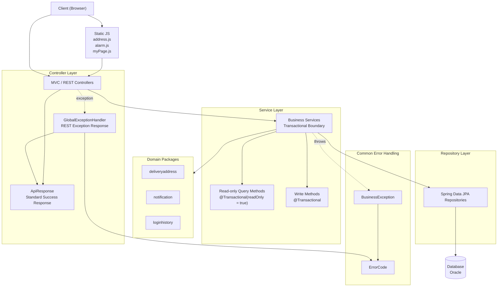

# 🚚 DeliveryPro

Spring Boot 기반 음식 배달 플랫폼 프로젝트입니다.
사용자 주문, 라이더 배달, 소셜 로그인, 메일 전송, 지도 기능 등을 포함한 웹 애플리케이션입니다.

---

## ⭐ Project Highlights

DeliveryPro는 기존 음식 배달 플랫폼의 기능을 유지하면서,
응답 구조, 예외 처리, 도메인 패키지, 트랜잭션 경계, 테스트 실행 환경을 단계적으로 정리한 리팩토링 프로젝트입니다.
단순 기능 구현을 넘어 Spring Boot 애플리케이션의 유지보수성과 테스트 가능성을 높이는 데 초점을 맞췄습니다.

* 공통 `ApiResponse`를 도입해 REST API 응답 형식을 일관되게 표준화했습니다.
* `BusinessException`, `ErrorCode`, `GlobalExceptionHandler`를 기반으로 예외 처리 흐름을 구조화했습니다.
* `DeliveryAddress`, `Notification`, `LoginHistory` 3개 도메인을 독립 패키지로 분리해 응집도를 높였습니다.
* Controller에 있던 트랜잭션 책임을 Service 계층으로 이동해 계층별 역할을 명확히 했습니다.
* 주요 Service의 `jakarta.transaction.Transactional`을 Spring `@Transactional`로 전환했습니다.
* 조회 전용 메서드에는 `@Transactional(readOnly = true)`를 적용해 트랜잭션 의도를 명확히 표현했습니다.
* 10개 이상 Service의 트랜잭션 적용 방식을 점진적으로 정리했습니다.
* `test` profile을 구축해 테스트 전용 설정을 분리하고, `compileJava`와 `test` 검증이 통과되도록 정리했습니다.

포트폴리오용 한 줄 요약:

DeliveryPro는 공통 응답/예외 처리, 도메인 패키지 분리, Service 중심 트랜잭션 관리, 테스트 profile 구축을 통해 유지보수성과 검증 가능성을 개선한 Spring Boot 기반 음식 배달 플랫폼입니다.

---

## 📌 Overview

DeliveryPro는 음식 주문부터 배달까지의 전체 흐름을 구현한 프로젝트입니다.
회원, 주문, 라이더, 인증, 외부 API 연동 기능을 포함하고 있습니다.

---

## 🛠 Tech Stack

### Backend

* Java 21
* Spring Boot 3.4
* Spring Data JPA
* Spring Security
* Spring Validation

### Frontend

* Thymeleaf

### Database

* Oracle DB

### Others

* Gradle
* WebSocket
* OAuth2 Client (Google / Naver / Kakao)
* Java Mail Sender

---

## ✨ Features

### 👤 User

* 회원가입 / 로그인
* 소셜 로그인 (Google, Naver, Kakao)

### 🛒 Order

* 음식 주문 생성
* 주문 내역 조회
* 주문 상태 관리

### 🏍 Rider

* 배달 상태 관리
* 라이더 관련 기능

### 📍 Map

* 지도 기반 위치 기능

### 📧 Mail

* 이메일 인증 및 발송

---

## 📂 Project Structure

```
src/main/java/com/icia/delivery
 ┣ controller
 ┃ ┣ member
 ┃ ┣ rider
 ┃ ┣ map
 ┃ ┗ admin
 ┣ service
 ┣ repository
 ┣ entity
 ┣ dto
 ┗ config
```

---

## 🏗 리팩토링 아키텍처

DeliveryPro는 리팩토링을 통해 공통 응답 구조, 예외 처리 흐름,
Service 중심 트랜잭션 경계, 도메인 패키지 분리를 명확히 했습니다.
아래 다이어그램은 리팩토링 후 주요 요청 처리 흐름과 계층별 책임을 보여줍니다.



### 계층별 역할

* **Client / Static JS**
  * 브라우저 요청과 화면 이벤트를 담당합니다.
  * `address.js`, `alarm.js`, `myPage.js`는 공통 응답 구조인 `ApiResponse`에 맞춰 응답을 처리합니다.

* **Controller Layer**
  * 요청을 받고 Service 계층을 호출합니다.
  * REST 응답은 `ApiResponse`로 표준화하고, 트랜잭션 책임은 Service 계층으로 이동했습니다.

* **Common Error Handling**
  * 비즈니스 예외는 `BusinessException`과 `ErrorCode`로 표현합니다.
  * REST 예외 응답은 `GlobalExceptionHandler`에서 일관된 구조로 변환합니다.

* **Service Layer**
  * 비즈니스 로직과 트랜잭션 경계를 담당합니다.
  * 조회 메서드는 `@Transactional(readOnly = true)`, 생성/수정/삭제 메서드는 기본 `@Transactional`을 적용해 의도를 명확히 했습니다.

* **Domain Packages**
  * `deliveryaddress`, `notification`, `loginhistory`를 도메인 단위 패키지로 분리했습니다.
  * 관련 Controller, Service, Repository, DTO, Entity를 응집도 있게 관리할 수 있도록 구조를 정리했습니다.

* **Repository Layer / Database**
  * Repository는 Spring Data JPA 기반 데이터 접근을 담당합니다.
  * 실제 저장소는 Oracle DB를 사용합니다.

### 리팩토링 전후 비교

리팩토링 전에는 응답 형식, 예외 처리, 트랜잭션 경계, 일부 도메인 코드의 위치가 기능별로 흩어져 있어
유지보수 기준이 명확하지 않았습니다.

리팩토링 후에는 공통 응답과 예외 처리 구조를 도입하고,
Controller의 트랜잭션 책임을 Service 계층으로 이동했으며,
핵심 도메인을 패키지 단위로 분리해 계층별 책임과 변경 범위를 명확히 했습니다.

### Portfolio Summary

DeliveryPro는 공통 응답/예외 처리, Service 중심 트랜잭션 관리,
도메인 패키지 분리를 통해 기존 기능을 유지하면서도 유지보수성과 확장성을 높인
Spring Boot 기반 음식 배달 플랫폼입니다.

---

## ⚙️ Configuration

이 프로젝트는 보안을 위해 민감 정보를 외부 설정으로 분리합니다.

자세한 로컬 실행 환경 설정은 [`docs/setup.md`](docs/setup.md)를 참고하세요.

### Required Environment Variables

* DB_USERNAME
* DB_URL
* DB_PASSWORD
* MAIL_USERNAME
* MAIL_PASSWORD
* NAVER_CLIENT_ID / NAVER_CLIENT_SECRET
* GOOGLE_CLIENT_ID / GOOGLE_CLIENT_SECRET
* KAKAO_CLIENT_ID / KAKAO_CLIENT_SECRET
* KAKAO_API_KEY
* KAKAO_JAVASCRIPT_KEY
* IPIFY_API_URL

---

## 🚀 Run

1. JDK 21 설치
2. Oracle DB 실행
3. 환경 변수 설정 또는 `application-local.properties` 생성
4. 실행

```
./gradlew bootRun
```

---

## 🧪 테스트 실행 방법

테스트는 `test` profile을 사용해 실행됩니다.
`DeliveryProApplicationTests`는 `@ActiveProfiles("test")`를 통해
`src/test/resources/application-test.properties` 설정을 로딩합니다.

테스트 profile에서는 Mail, OAuth, Kakao, IP 조회 API 관련 값은
컨텍스트 로딩용 더미값으로 처리합니다.
단, 현재 테스트는 Spring Context와 JPA 설정을 함께 로딩하므로
Oracle DB 연결 정보는 환경 변수로 제공해야 합니다.

### Required Test Environment Variables

* `DB_URL`
* `DB_USERNAME`
* `DB_PASSWORD`

### Windows CMD 예시

```cmd
set DB_URL=jdbc:oracle:thin:@<host>:<port>/<service_name>
set DB_USERNAME=<oracle_username>
set DB_PASSWORD=<oracle_password>
```

실제 비밀번호나 API Key는 README에 작성하지 않고,
로컬 환경 변수 또는 개인 설정으로만 관리합니다.

### 테스트 실행 명령어

```cmd
.\gradlew.bat compileJava
.\gradlew.bat test
```

---

## 🧪 Troubleshooting

### 1. Controller Bean 충돌

* 동일한 이름의 Controller 클래스가 존재할 경우 충돌 발생
* 해결: 클래스명 변경 (예: `MapController` → `RiderMapController`)

### 2. Gradle / Spring Boot 버전 충돌

* Spring Boot 3.4 사용 시 Gradle 8.14 이상 필요

### 3. Lombok @Builder 경고

* 기본값 유지 시 `@Builder.Default` 사용 필요

---

## 🔒 Security Notice

비밀번호, API 키, OAuth Secret 등 민감 정보는
GitHub에 포함되어 있지 않으며, 환경 변수로 관리됩니다.

---

## 📌 Future Improvements

* REST API 구조로 리팩토링
* JWT 기반 인증 적용
* Docker 및 배포 환경 구성
* 프론트엔드 분리 (React/Vue)

---

## 👨‍💻 Author

* Sanghyeok Lee
